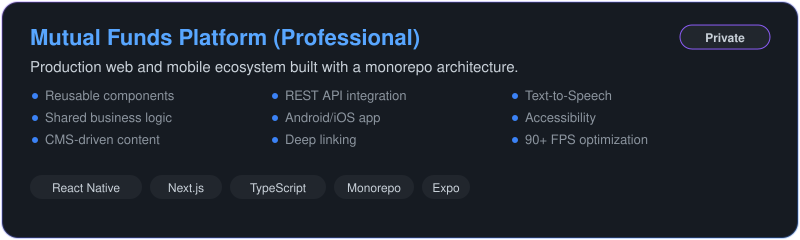

   
  <picture>
    
  </picture>
   
  <picture>
    
  </picture>
   
  

    I build production web and cross-platform mobile applications using React, React Native, Expo, Next.js, and TypeScript.  
    Currently working on production applications using React Native (Expo), Next.js, TypeScript, Redux Toolkit, and RTK Query within a monorepo architecture.
  

   
  
  &nbsp;
  
  &nbsp;
  
    
  
  <table width="100%" border="0" cellspacing="0" cellpadding="0">
    <tr>
      <td align="center" valign="middle">
        
      </td>
    </tr>
  </table>
    

  
   
  
     

  
   
  
  <!-- Natter -->
  
   
  
  &nbsp;
  
    
  
  <!-- ShopSphere -->
  
   
  
    

  <!-- Mutual Funds -->
  
     

  
   
  
     

  
   
  

    
      
    
  

     

  
   
  

    
    &nbsp;
    
    &nbsp;
    
  

     

  
    

